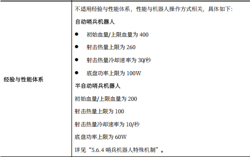

# 烧饼导航快速入门

BY MAii6799

**仅适用于以NAV2为基础框架的烧饼导航**

**开始的开始，请熟读[提问的智慧](Navigation\资料\提问的智慧.pdf)**

感谢本文档指导**HDA27**，李哥你真的是一个非常厉害的学长！！

## 基础依赖

- 电脑系统：Ubuntu22.04
- ros2版本：humble
- 雷达设备：MID360，留形odin1
- 学习基础：C++，git，cmake，rm比赛规则，**记得都去学喵**

## 此教程包含
- 烧饼介绍与规则更新
- 导航介绍
- 教程资料
- 开源资料
- 仿真学习
- TODO LIST
- 实车调试（雷达使用与NAV2调参）

## 烧饼介绍与规则更新

1. 比赛开局无需花钱买弹，初始发弹量有300，os步兵是0

2. 全自动烧饼初始血量和热量和功率上限又是几号步兵的一辈子^-^

3. 今年烧饼**新增加了一个特殊机制**，姿态的切换，这一部分由决策负责。

4. **与导航相关的最大规则更新**是今年取消了赛前建图环节

5. 我们26赛季的烧饼，，他还只是一块扁扁的饼，希望有一天他真的会变成哨兵机器人TvT


`
首先我们需要明确烧饼是什么。
你可以把7号哨兵机器人理解为一个步兵，但是他：开局就是满级+开局无需买弹丸+没有操作手全自动。
从比赛规则上来说，哨兵是一个机制非常强的机器人。
所以真的真的要把烧饼做好！！！！
`

## 导航介绍
`
最开始的开始，我们要知道烧饼导航是负责做什么的。
作为一个全自动机器人，比赛开始后，给烧饼发送一个战场上要到达的目标点，这是决策要做的事情。
而让烧饼知道自己应该怎么走到这个目标点，这才是导航需要做的事情。 
`

`
由此，我们可以把导航分成三个最简步骤:
`

1. 收到一个**目标点goal**
2. 在地图中**规划**出从当前起点到目标点goal的路线
3. 根据规划的路线计算控制机器人移动的**线速度和角速度**，发送给下位机

`
但是我们烧饼作为一个全自动机器人，会发现仅仅有这三个步骤是远远不够的！第一，怎么获取赛场地图，第二，怎么让烧饼知道自己现在在地图上的哪个位置，第三，现实中出现了地图上没有的新障碍物应该如何及时避障，所以，我们有接下来的三个新要求
`

4. 对场地**建图**，获得一张栅格地图
5. **定位与重定位**
6. 对地图上没有的新障碍物进行**感知与避障**


<mark>以上，是我们导航要做的全部事情</mark>

## 教程资料

1. [导航通识概念](https://www.bilibili.com/video/BV1HDg3z5EGT/?spm_id_from=333.1387.homepage.video_card.click&vd_source=28d44b8627aa2be2fd8cac75aad69faa)：这是火锅战队做的一个导航组第一次培训视频，讲的很好

2. [NAV2官网](https://docs.nav2.org/)：这一部分主要看Navigation Concept和First-Time Robot Setup Guide，了解一下导航基本概念，对nav2这个东西有点感觉，做一个导航仿真小小小项目起手

3. [SLAM十四讲](Navigation\资料\slam十四讲第二版.pdf)：被称为slam圣经的东西，但是我至今没看完一半。数学，没什么好看的。

4. [了解CV和RoboMaster视觉组](Navigation\资料\了解CV和RoboMaster视觉组.pdf)：据说是视觉圣经但是我也没看完对不起！


## 开源资料

~~李哥说导航这个东西不抄开源是做不出来的我完全认可~~

1. [深圳北理莫斯科大学北极熊战队25赛季导航](https://github.com/SMBU-PolarBear-Robotics-Team/pb2025_sentry_nav)

2. [深北莫导航配套虚拟仿真](https://github.com/SMBU-PolarBear-Robotics-Team/rmu_gazebo_simulator)

3. [辽科大cod战队26赛季RMUL导航](https://bbs.robomaster.com/article/1882897?source=8)

4. [武汉科技大学崇实战队26赛季导航](https://github.com/hyheiyue/rose_navigation)

5. [四川大学火锅战队25赛季导航](https://github.com/PolarisXQ/SCURM_SentryNavigation)

6. [中南大学FYT战队23赛季导航](https://github.com/baiyeweiguang/CSU-RM-Sentry)


`
1和2和3都是目前必须要看的，需要了解深北莫每个包的作用，学习派大星开源的框架和项目结构，真的非常非常好，总之比我的好很多，，武科的开源也需要严肃学习！因为NAV2对于rm比赛来说还是太冗余，武科是自己搭建的框架，比NAV2精简很多，并且环境和我们现在的是一样的喵喵
`

`
纯里程计导航对于UL来说完全够用，并且cod战队开源提供的多点导航思路相比起单点导航在UL场地上更不容易卡进死区，而且到达控制区目标点的速度也会更快，今年我们的烧饼在整场UL中只出过一次家门还死在半路了，希望明年可以做得更好^-^
`

## 仿真学习
学完入门基础教程之后就可以开始狠狠play[深北莫仿真包](https://github.com/SMBU-PolarBear-Robotics-Team/rmu_gazebo_simulator)了，其他什么都不用管，第一件事情和部署自瞄包一样,先把深北莫的导航仿真和代码部署好跑一遍，跑起来之后通过以下命令行
＋rqt看他的**各个消息节点和数据流，以及消息发布的内容格式**：

查看导航包发布的ros2话题
```
ros2 topic list 
```
查看导航话题信息（**可以看topic的pulisher，subscriber分别是哪些node，用这个结合rqt可视化可以把数据流画出来**）
```
ros2 topic info -i /话题名
ros2 topic info -i /节点名
```
查看话题内部数据发布
```
ros2 topic echo /话题名
```
查看导航包发布的节点
```
ros2 node list
```

`
这一部分需要了解导航包数据流向和各个功能包的作用，可以从bringup这个包的launch文件开始看，launch文件可以看一个哨兵某个功能的实现需要启动哪些节点，再然后重要的是看config文件，了解有哪些参数是可调的。
从雷达获取的输入点云和里程计数据开始，到最后NAV2输出/cmd_vel数据，中间经过的数据处理是什么。完全走通之后才能去考虑代码能够优化的部分有哪些，以及实车的调试我们需要做什么。
还有一个重要的点就是TF变换，需要了解导航哪些包会发布TF，发布了从谁到谁的TF。
`

## TODO LIST
`
学习导航最大的问题其实是不知道该从哪开始以及下一步该怎么做，我做烧饼导航的这一年经常觉得非常迷茫，，上车调试的时间又几乎集中在比赛前那段时间，所以很难获得一些学习上的正向反馈，会觉得自己比其他视觉的同学菜很多，，也有可能事实如此，，，所以我们需要有一个学习的路线和阶段性的目标，防止自己陷入下一步该做什么的困惑当中，也算是导航组小灯的阶段验收作业
`
- [ ] 先学会ROS2，能够使用基本ROS2命令行，看得懂C++代码，会用git提交仓库，会用cmake编译
- [ ] 了解导航基本概念：规划器，控制器，栅格地图，代价地图，全局地图，局部地图，导航的cmd_vel输出，SLAM，全局定位与重定位
- [ ] 能在自己电脑上跑北极熊的导航仿真包，不要求直接开始看代码，先跑仿真玩玩看
- [ ] 开启仿真后看导航有哪些ROS2节点和话题，理清楚数据流向和TF变换：输入是雷达数据，pointcloud和imu，输出是/cmd_vel。中间过程需要厘清，知道导航每一个功能包的作用
- [ ] 严肃学习开源资料
- [ ] 知道搭建一个导航系统需要哪些部分：感知，规划，控制
- [ ] 学习使用雷达，并且能够知道
- [ ] 基于NAV2框架自己搭建一个最简单的可用于我们的烧饼的导航


`
把以上任务都做完你就已经是一个成熟的导航大手子了！
`
 


## 实车调试

<mark>记得把use_sim_time=true改成false</mark>

`
从仿真了解完导航各个功能包后就可以尝试在实车上部署代码了！一定是会遇到很多奇怪的问题的不用太焦虑！有问题实在无法解决的记得找老登。从使用雷达开始。
`

### 雷达使用

启动MID360并可视化：

[MID360用户手册下载链接](https://www.livoxtech.com/cn/downloads)

1. 安装SDK：https://github.com/Livox-SDK/Livox-SDK2
2. 安装雷达驱动：https://github.com/Livox-SDK/livox_ros_driver2
3. 安装[Livox_viewer](https://www.livoxtech.com/cn/downloads)或者在foxglove里面看扫描到的点云
4. 在你自己的电脑上初次使用雷达驱动来启动雷达，需要修改的参数是config文件里的lidar_ip,每个mid360都有自己的ip，<mark>我们的mid360的ip是192.168.1.106</mark>。
5. 配置你电脑的ip，改成192.168.1.50
6. 原神

启动odin1：

[odin1用户手册](https://manifoldtechltd.github.io/wiki/Odin1/Cover.html)

1. 安装雷达驱动：https://github.com/manifoldsdk/odin_ros_driver
2. 对设备进行固件升级：https://vvcazjv268.feishu.cn/file/AAsOba7nSoGj22xclcKcoadEnfc **最新固件看售后群**
3. 对于odin1生成和记录下来的点云，需要使用留形科技自己开发的mindcloud软件查看和编辑，windows系统上安装需要找售后要license，Ubuntu上不用：https://version.manifoldtech.cn/download/mcs
4. 原神


### 调参环节
<mark>和电控联调的时候千万不要忘记打开串口通信啊！！！！</mark>

1. 对于NAV2来说，导航这个东西具体实现都被内部封装好了，你只要在NAV2的config里面调整参数就行了，主要需要调参的部分是<mark>控制器</mark>，其他部分视情况，比如代价地图的大小，**当然如果之后我们不使用NAV2作为导航工具了那另说**
2. odin1偶尔会出现无法正常启动驱动的情况，首先尝试重启，检查完硬件部分确认无误后，如果还是不行，重新对odin1进行固件升级看看
3. 如果烧饼走起来有问题：
    - 走起来一卡一卡的，检查/sentry/cmd_vel的输出是否连续
    - 一动不动，检查串口通信开了没，然后再检查/sentry/cmd_vel的输出
    - 走不了直线，把导航关掉，给/sentry/cmd_vel话题发送固定值，看能不能正常走路

    ~~排除完问题还是不正常的话可以去攻击电控了~~
4. 今年和去年都有出现烧饼不能正常走直线的问题，今年具体表现为走直线的时候会有一个45°的偏向，导航的输出是正常的朝前走的情况下车会斜着走。换过新的电机，但是问题没有消失。这是一个暂未解决的问题。

## 一点乱七八糟的失败经验总结环节

对于本赛季从UL到UC都有非常多的遗憾，UL一场都没有出家门，在三天的比赛中起到的作用是0，很伤心，当然负责烧饼UL自瞄的队友强烈要求补充说明的是少爷在第二场比赛中打出了两发小弹丸^-^，，，至于UC，在比赛的最后一天晚上老队长拉着电控和结构通宵一晚上重新调了一版自瞄出来，比之前真的好很多很多。但是第二天对战南理工江阴的比赛真是吓哭了对面哨兵十秒开前哨，，唉

对于26赛季我最大的感受就是进度太赶了，赛前根本来不及进行完整测试，单个的功能测试的次数又太少，导致比赛的时候出现了各种各样的问题。可以说比赛之前车在我手上调的时间很短，比赛日期间，每场比赛下来第一件事情就是我拿着电脑一点点回放烧饼的代码运行日志，看哪里有问题和报错，然后找电控修车，往往回放日志查问题要查很久，看的很痛苦，但是心情是，只要是更改代码能解决的都不是问题，最难受的是设备本身坏了，比如odin1在UC的时候还在找售后，更新固件来不及的时候就要上比赛了，当时真的有种等死的感觉。

综上，最重要的是<mark>出车进度</mark>！一定一定要注意时间和进度，电控和结构要记得给视觉预留调车时间，尤其是烧饼组，作为全自动机器人，给视觉留的时间太少真的不行！不过进度也和dji出的新规则相关，当时UC出新规则的时候，我们烧饼组：卧槽太坏了所有人的进度都有了新的退展。。

第二重要的是<mark>赛前测试环节</mark>，烧饼一定一定要多连服务器测试，并且是全局比赛的完整测试，要对不同的状况进行测试，比如模拟敌人攻击，模拟前哨站被摧毁，决策给出的不同方案全都要测试。

第三，比赛的时候一定要把<mark>代码运行日志保存</mark>下来，方便赛后查问题。
