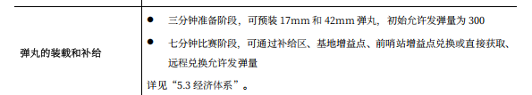
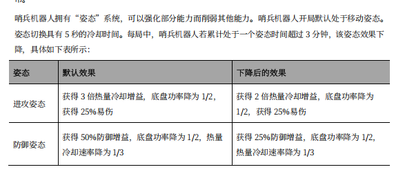
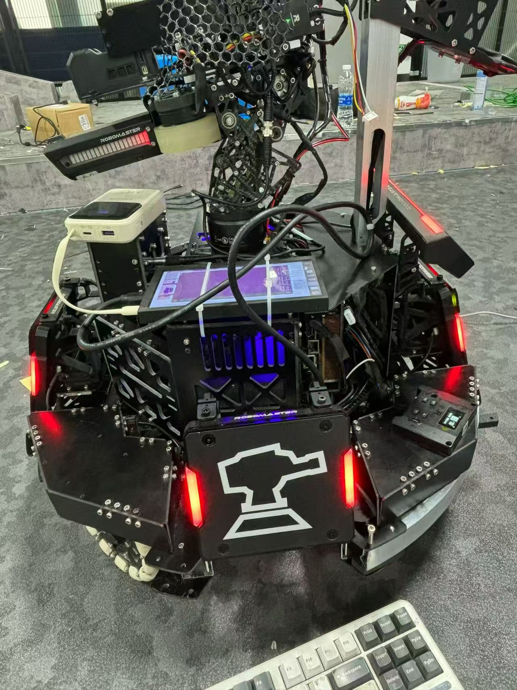

# 烧饼导航快速入门

***仅适用于以NAV2为基础框架的烧饼导航***

## 基础依赖

- 电脑系统：Ubuntu22.04
- ros2版本：humble
- 雷达设备：MID360，留形odin1
- 学习基础：C++，git，cmake，rm比赛规则

## 烧饼介绍

1. 比赛开局无需花钱买弹，初始发弹量有300，os步兵是0

2. 全自动烧饼初始血量和热量和功率上限又是几号步兵的一辈子^-^

3. 今年烧饼新增加了一个特殊机制，姿态的切换，这一部分由决策负责。

4. 我们26赛季的烧饼，，他还只是一块扁扁的饼，希望有一天他真的会变成哨兵机器人TvT


```
首先我们需要明确烧饼是什么。
你可以把7号哨兵机器人理解为一个步兵，但是他：开局就是满级+开局无需买弹丸+没有操作手全自动。
从比赛规则上来说，哨兵是一个机制非常强的机器人。
所以真的真的要把烧饼做好！！！！负责决策和导航的同学要商量好烧饼在哪个时间段往哪走，遇到敌人要做出怎么样的行为，打蛋是控制打蛋还是全自动打蛋。
```

## 导航教程

1. [导航通识概念](https://www.bilibili.com/video/BV1HDg3z5EGT/?spm_id_from=333.1387.homepage.video_card.click&vd_source=28d44b8627aa2be2fd8cac75aad69faa)：这是火锅战队做的一个导航组第一次培训视频，讲的很好

2. [NAV2官网](https://docs.nav2.org/)：这一部分主要看Navigation Concept和First-Time Robot Setup Guide，了解一下导航基本概念，对nav2这个东西有点感觉，做一个导航仿真小小小项目起手

```
最开始的开始，我们要知道烧饼导航是负责做什么的。
作为一个全自动机器人，我们要让他知道自己应该往哪里走，怎么走，
```


## 开源资料

~~李哥说导航这个东西不抄开源是做不出来的我完全认可~~

1. [深圳北理莫斯科大学北极熊战队25赛季导航](https://github.com/SMBU-PolarBear-Robotics-Team/pb2025_sentry_nav)

2. [深北莫导航配套虚拟仿真](https://github.com/SMBU-PolarBear-Robotics-Team/rmu_gazebo_simulator)

3. [辽科大cod战队26赛季RMUL导航](https://bbs.robomaster.com/article/1882897?source=8)

3. [四川大学火锅战队25赛季导航](https://github.com/PolarisXQ/SCURM_SentryNavigation)

4. [中南大学FYT战队23赛季导航](https://github.com/baiyeweiguang/CSU-RM-Sentry)


```   
1和2都是目前必须要看的，需要了解深北莫每个包的作用，学习派大星开源的框架和项目结构，真的非常非常好，总之比我的好很多，，
纯里程计导航对于UL来说完全够用，并且cod战队开源提供的多点导航思路相比起单点导航在UL场地上更不容易卡进死区，而且到达控制区目标点的速度也会更快，今年我们的烧饼在整场UL中只出过一次家门还死在半路了，希望明年可以做得更好^-^
```

## 开源资料学习思路
学完入门基础教程之后就可以开始狠狠play[深北莫仿真包](https://github.com/SMBU-PolarBear-Robotics-Team/rmu_gazebo_simulator)了，其他什么都不用管，第一件事情和部署自瞄包一样,先把深北莫的导航仿真和代码部署好跑一遍，跑起来之后通过以下命令行
＋rqt看他的**各个消息节点和数据流，以及消息发布的内容格式**：

查看导航包发布的ros2话题
```
ros2 topic list 
```
查看导航话题信息（**可以看topic的pulisher，subscriber分别是哪些node，用这个结合rqt可视化可以把数据流画出来**）
```
ros2 topic info -i /话题名
ros2 topic info -i /节点名
```
查看话题内部数据发布
```
ros2 topic echo /话题名
```
查看导航包发布的节点
```
ros2 node list
```

```
这一部分需要了解导航包数据流向和各个功能包的作用，可以从bringup这个包的launch文件开始看，launch文件可以看一个哨兵某个功能的实现需要启动哪些节点，再然后重要的是看config文件，了解有哪些参数是可调的。
从雷达获取的输入点云和里程计数据开始，到最后NAV2输出/cmd_vel数据，中间经过的数据处理是什么。完全走通之后才能去考虑代码能够优化的部分有哪些，以及实车的调试我们需要做什么。
还有一个重要的点就是TF变换，需要了解导航哪些包会发布TF，发布了从谁到谁的TF。
```


## 雷达使用与实车调试

<mark>记得把use_sim_time=true改成false</mark>
```
从仿真了解完导航各个功能包后就可以尝试在实车上部署代码了！一定是会遇到很多奇怪的问题的不用太焦虑！有问题实在无法解决的记得找老登。从使用雷达开始。
```

### 雷达使用

启动MID360并可视化：

1. 安装SDK：https://github.com/Livox-SDK/Livox-SDK2
2. 安装雷达驱动：https://github.com/Livox-SDK/livox_ros_driver2
3. 安装Livox_viewer或者在foxglove里面看扫描到的点云
4. 在你自己的电脑上初次使用雷达驱动来启动雷达，需要修改的参数是config文件里的lidar_ip,每个mid360都有自己的ip，我们的mid360的ip是192.168.1.106。
5. 配置你电脑的ip，改成192.168.1.50
6. 原神

启动odin1：

[odin1用户手册](https://manifoldtechltd.github.io/wiki/Odin1/Cover.html)

1. 安装雷达驱动：https://github.com/manifoldsdk/odin_ros_driver
2. 对设备进行固件升级：https://vvcazjv268.feishu.cn/file/AAsOba7nSoGj22xclcKcoadEnfc **最新固件看售后群**
3. 对于odin1生成和记录下来的点云，需要使用留形科技自己开发的mindcloud软件查看和编辑，windows系统上安装需要找售后要license，Ubuntu上不用：https://version.manifoldtech.cn/download/mcs
4. 原神


### 调试环节
<mark>和电控联调的时候千万不要忘记开串口通信啊！！！！</mark>

1. 对于NAV2来说，导航这个东西具体实现都被内部封装好了，你只要在NAV2的config里面调整参数就行了，主要需要调参的部分是<mark>控制器</mark>，其他部分视情况，比如代价地图的大小，**当然如果之后我们不使用NAV2作为导航工具了那另说**
2. odin1偶尔会出现无法正常启动驱动的情况，首先尝试重启，检查完硬件部分确认无误后，如果还是不行，重新对odin1进行固件升级看看
3. 如果烧饼走起来有问题：
    - 走起来一卡一卡的，检查/sentry/cmd_vel的输出是否连续
    - 一动不动，检查串口通信开了没，然后再检查/sentry/cmd_vel的输出
    - 走不了直线，把导航关掉，给/sentry/cmd_vel话题发送固定值，看能不能正常走路

    ~~排除完问题还是不正常的话可以去攻击电控了~~

